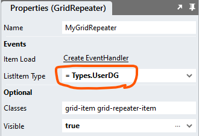
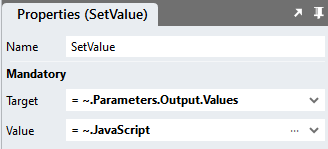

# Repeater As DataGrid <!-- omit in toc -->
Using this module, you can use a *Repeater* control to create a server-side DataGrid that looks and works similar to the standard Stadium *DataGrid* control. 

The module comes with two scripts and two CSS files. The scripts provide functionality to facilitate the rendering, sorting and paging features. The CSS makes a Stadium *Repeater* control look like a DataGrid. The *Repeater* control must be custom built to look like the dataset that it will display. 

To illustrate this module, it comes with a sample application that displays data from a database table with 2 million records. This module can be configured to use any connector and data source, and works with data sources of any size. 

## Contents <!-- omit in toc -->
- [Version](#version)
- [Database](#database)
- [Application](#application)
  - [Application Properties](#application-properties)
  - [Connector](#connector)
    - [Queries](#queries)
  - [Type](#type)
  - [Page](#page)
    - [Container](#container)
    - [Grid](#grid)
    - [Repeater](#repeater)
  - [Global Scripts](#global-scripts)
    - [Initialising the module](#initialising-the-module)
    - [Querying state of the DataGrid](#querying-state-of-the-datagrid)
  - [DataGrid Events](#datagrid-events)
    - [Sorting](#sorting)
    - [Paging](#paging)
    - [Link Columns](#link-columns)
  - [Page.Load](#pageload)
  - [CSS Setup](#css-setup)
    - [Customising CSS](#customising-css)
    - [CSS Upgrading](#css-upgrading)
- [Custom Filters](#custom-filters)
- [Loading Spinners](#loading-spinners)

# Version
1.0 initial

# Database
The module can be configured to work with any data source and connector. 

The attached example application uses a database connector and queries. To run the sample application, you need to:
1. Create a database in a SQL Server instance called "StadiumLoadTest"
2. The unzip and run the SQL script in the database folder in this repo (this will create a table called "User") [script file](database/script.zip)

# Application

## Application Properties
1. Check the *Enable Style Sheet* checkbox in the application properties

## Connector
Set up your connector as you normally would. 

To run the example application, create a database connector to the database you [created above](#database-setup). 

### Queries
The module requires two data sets: 

1. The total number of records
2. The data to be attached to the *Repeater* (a list of objects from a database or an API)

Add the basic queries below include parameters for paging and sorting

Example "TotalRecords" Query
```sql
select count(ID) as total from [User]
```

Example "Select" Query
```sql
SELECT 
	ID
    ,name
    ,gender
    ,address
    ,birthdate
    ,adddatetime
  FROM [User]
  ORDER BY
  case when UPPER(@sortField) = 'ID' AND (LOWER(@sortDirection) = 'asc' OR @sortDirection = '') THEN ID END ASC,
  case when UPPER(@sortField) = 'ID' AND LOWER(@sortDirection) = 'desc' THEN ID END DESC,
  case when LOWER(@sortField) = 'name' AND (LOWER(@sortDirection) = 'asc' OR @sortDirection = '') THEN [name] END ASC,
  case when LOWER(@sortField) = 'name' AND LOWER(@sortDirection) = 'desc' THEN [name] END DESC,
  case when LOWER(@sortField) = 'gender' AND (LOWER(@sortDirection) = 'asc' OR @sortDirection = '') THEN gender END ASC,
  case when LOWER(@sortField) = 'gender' AND LOWER(@sortDirection) = 'desc' THEN gender END DESC,
  case when LOWER(@sortField) = 'address' AND (LOWER(@sortDirection) = 'asc' OR @sortDirection = '') THEN [address] END ASC,
  case when LOWER(@sortField) = 'address' AND LOWER(@sortDirection) = 'desc' THEN [address] END DESC,
  case when LOWER(@sortField) = 'birthdate' AND (LOWER(@sortDirection) = 'asc' OR @sortDirection = '') THEN birthdate END ASC,
  case when LOWER(@sortField) = 'birthdate' AND LOWER(@sortDirection) = 'desc' THEN birthdate END DESC,
  case when @sortField = '' then ID end ASC,
  case when @sortField = 'undefined' then ID end ASC
OFFSET @offsetRows ROWS FETCH NEXT @pageSize ROWS ONLY
```


## Type
Add a new type that contains all the properties (columns) in your dataset. 

The example dataset type is called "UserDG" and contains the following columns:
1. ID (Any)
2. name (Any)
3. gender (Any)
4. address (Any)
5. birthdate (Any)
6. adddatetime (Any)


## Page
To function correctly, the page must contain a number of controls. Some of these provide for DataGrid-specific functions, like paging, while others serve to simply display the data from your dataset. Each control set is defined in detail below. 

The final set of controls for the example application will look like this:


### Container
1. Drag a *Container* control to the page
2. Give it a suitable name (e.g. ServerSideDataGridContainer)
3. Add a class of your choice to the control *Classes* property to uniquely identify the control (e.g. server-side-datagrid)

### Grid
1. Drag a *Grid* control into the *Container* control
2. For each column you wish to display
   1. Drag a *Link* control into the *Grid* if the column must be sortable
   2. Drag a *Label* control into the *Grid* if the column should not be sortable
   3. Leave the column empty if you don't want to display a column header


### Repeater
1. Drag a *Repeater* control into the *Grid* control (under the header row)
2. Assign the *Type* you created above to the *Repeater* *ListItem Type* property

3. For each column you wish to display
   1. Drag a *Label* control into the *Grid*
   2. Map the correct ListItem Property to the *Label Text* property (example shows the "ID" Label)


## Global Scripts
The module requires two global scripts. The first one is used to set up the repeater to look and function like a DataGrid. The second one is used to query the module to find out how the DataGrid is sorted, what page of data must be shown and how many records a page must contain. 

### Initialising the module
1. Create a Global Script called "RepeaterDataGridInit"
2. Add the input parameters below to the Global Script
   1. ContainerClass
   2. DefaultSortField
   3. PageSize
   4. TotalRecords
3. Drag a *JavaScript* action into the script
4. Add the Javascript below into the JavaScript code property
```javascript
/* Stadium Script v1.0 Init https://github.com/stadium-software/repeater-datagrid */
let scope = this;
let pageSize = parseInt(~.Parameters.Input.PageSize);
let sortField = ~.Parameters.Input.DefaultSortField;
let totalRecords = parseInt(~.Parameters.Input.TotalRecords);
let containerClass = ~.Parameters.Input.ContainerClass;
if (!containerClass) {
     console.error("The ContainerClass parameter is required");
     return false;
}
let container = document.querySelectorAll("." + containerClass);
if (container.length == 0) {
    console.error("The class '" + containerClass + "' is not assigned to any container");
    return false;
} else if (container.length > 1) {
    console.error("The class '" + containerClass + "' is assigned to multiple containers");
    return false;
} else { 
    container = container[0];
}
container.classList.add("stadium-dg-repeater");
let getObjectName = (obj) => {
    let objname = obj.id.replace("-container","");
    do {
        let arrNameParts = objname.split(/_(.*)/s);
        objname = arrNameParts[1];
    } while ((objname.match(/_/g) || []).length > 0 && !scope[`${objname}Classes`]);
    return objname;
};
let sortEl = container.querySelector(".asc, .desc");
if (sortEl) sortEl.classList.remove("asc", "desc");
let cells = container.querySelectorAll(".grid-item");
let headerCells = container.querySelectorAll(".grid-item:not(.grid-repeater-item)");
let cellsPerRow = headerCells.length;
let cellCount = 0;
let alt = false;
for (let i = 0; i < cells.length; i++) {
    cellCount++;
    if (alt) cells[i].classList.add("dg-alternate-row");
    if (!alt) cells[i].classList.add("dg-row");
    if (cellCount == 1) cells[i].classList.add("dg-first-cell");
    if (cellCount == cellsPerRow) {
        cells[i].classList.add("dg-last-cell");
        cellCount = 0;
        alt = !alt;
    }
}
sessionStorage.setItem(containerClass + "_Page", 1);
sessionStorage.setItem(containerClass + "_PageSize", pageSize);
sessionStorage.setItem(containerClass + "_Offset", 0);
sessionStorage.setItem(containerClass + "_TotalRecords", totalRecords);
sessionStorage.setItem(containerClass + "_TotalPages", Math.ceil(totalRecords / pageSize));
sessionStorage.setItem(containerClass + "_SortDirection", "");
sessionStorage.setItem(containerClass + "_SortField", sortField);
setPageLabel();
setNextButton(1);
setPrevButton(1);

for (let i = 0; i < headerCells.length; i++) {
    let inner = headerCells[i].querySelector(".link-container .btn-link");
    if (inner) inner.addEventListener("mousedown", setSort);
}
if (container.querySelector(".previous-button")) { 
    container.querySelector(".previous-button button").addEventListener("mousedown", previousPage);
    container.querySelector(".previous-button").classList.add("disabled");
}
if (container.querySelector(".next-button")) { 
    container.querySelector(".next-button button").addEventListener("mousedown", nextPage);
}
if (container.querySelector(".specific-page-go")) { 
    container.querySelector(".specific-page-go button").addEventListener("mousedown", setPage);
}
function previousPage() {
    let page = parseInt(sessionStorage.getItem(containerClass + "_Page"));
    if (page > 1) { 
        page = page - 1;
        sessionStorage.setItem(containerClass + "_Page", page);
        let offset = page * pageSize - pageSize;
        sessionStorage.setItem(containerClass + "_Offset", offset);
    }
    setNextButton(page);
    setPrevButton(page);
    setPageLabel();
}
function setPrevButton(pg) { 
    let previousButton = container.querySelector(".previous-button");
    if (pg == 1) {
        previousButton.classList.add("disabled");
    } else { 
        previousButton.classList.remove("disabled");
    }
}
function nextPage() {
    let page = parseInt(sessionStorage.getItem(containerClass + "_Page"));
    if (page < parseInt(sessionStorage.getItem(containerClass + "_TotalPages"))) { 
        page = page + 1;
        sessionStorage.setItem(containerClass + "_Page", page);
        let offset = page * pageSize - pageSize;
        sessionStorage.setItem(containerClass + "_Offset", offset);
    }
    setNextButton(page);
    setPrevButton(page);
    setPageLabel();
}
function setNextButton(pg) { 
    let nextButton = container.querySelector(".next-button");
    if (pg == parseInt(sessionStorage.getItem(containerClass + "_TotalPages")) || parseInt(sessionStorage.getItem(containerClass + "_TotalPages")) < 2) {
        nextButton.classList.add("disabled");
    } else { 
        nextButton.classList.remove("disabled");
    }
}
function setPage() {
    let pageInputContainer = container.querySelector(".specific-page");
    let pageInput = pageInputContainer.querySelector("input");
    let page = pageInput.value;
    if (!isNaN(page) && page > 0 && page <= parseInt(sessionStorage.getItem(containerClass + "_TotalPages"))) {
        sessionStorage.setItem(containerClass + "_Page", page);
        let offset = page * pageSize - pageSize;
        sessionStorage.setItem(containerClass + "_Offset", offset);
        setNextButton(page);
        setPrevButton(page);
        setPageLabel();
    }
    setDMValues(pageInputContainer, "Text", "");
}
function setPageLabel() {
    if (container.querySelector(".current-page") && parseInt(sessionStorage.getItem(containerClass + "_TotalPages")) > 0) {
        container.querySelector(".current-page span").textContent = "Page " + parseInt(sessionStorage.getItem(containerClass + "_Page")).toLocaleString() + " of " + parseInt(sessionStorage.getItem(containerClass + "_TotalPages")).toLocaleString();
    } else if (parseInt(sessionStorage.getItem(containerClass + "_TotalPages")) == 0) { 
        container.querySelector(".current-page span").textContent = "No records found";
    }
}
function setSort(e) { 
    let clickedEl = e.target;
    let colHead = clickedEl.textContent.toLowerCase();
    sessionStorage.setItem(containerClass + "_SortField", clickedEl.textContent);
    let currentSort = container.querySelector(".asc, .desc");
    let allHeaders = container.querySelectorAll(".grid-item:not(.grid-repeater-item) .link-container");
    if (!currentSort) {
        for (let i = 0; i < allHeaders.length; i++) {
            if (allHeaders[i].textContent.toLowerCase() == colHead.toLowerCase()) {
                allHeaders[i].classList.add("asc");
            }
        }
    } else if (currentSort.classList.contains("desc") && (currentSort.textContent.toLowerCase() == colHead.toLowerCase())) {
        currentSort.classList.remove("desc");
        currentSort.classList.add("asc");
        sessionStorage.setItem(containerClass + "_SortDirection", "asc");
    } else if (currentSort.classList.contains("asc") && (currentSort.textContent.toLowerCase() == colHead.toLowerCase())) {
        currentSort.classList.remove("asc");
        currentSort.classList.add("desc");
        sessionStorage.setItem(containerClass + "_SortDirection", "desc");
    } else if ((currentSort.classList.contains("asc") || currentSort.classList.contains("desc")) && (currentSort.textContent.toLowerCase() != colHead.toLowerCase())) {
        currentSort.classList.remove("asc", "desc");
        for (let i = 0; i < allHeaders.length; i++) {
            if (allHeaders[i].textContent.toLowerCase() == colHead.toLowerCase()) {
                allHeaders[i].classList.add("asc");
                sessionStorage.setItem(containerClass + "_SortDirection", "asc");
            }
        }
    }
}
function setDMValues(ob, property, value) {
    let obname = getObjectName(ob);
    scope[`${obname}${property}`] = value;
}
```

### Querying state of the DataGrid
1. Create a second Global Script called "RepeaterDataGridState"
2. Add the input parameters below to the Global Script
   1. ContainerClass
3. Add the output parameters below to the Global Script
   1. Values
4. Drag a *JavaScript* action into the script
5. Add the Javascript below into the JavaScript code property
```javascript
/* Stadium Script v1.0 GetData https://github.com/stadium-software/repeater-datagrid */
let scope = this;
let containerClass = ~.Parameters.Input.ContainerClass;
if (!containerClass) {
     console.error("The ContainerClass parameter is required");
     return false;
}
let container = document.querySelector("." + containerClass);
let getObjectName = (obj) => {
     let objname = obj.id.replace("-item0-cell0-container", "");
     do {
          let arrNameParts = objname.split(/_(.*)/s);
          objname = arrNameParts[1];
     } while ((objname.match(/_/g) || []).length > 0 && !scope[`${objname}Classes`]);
     return objname;
};
return { Page: sessionStorage.getItem(containerClass + "_Page"),
     PageSize: sessionStorage.getItem(containerClass + "_PageSize"),
     Offset: sessionStorage.getItem(containerClass + "_Offset"),
     TotalRecords: sessionStorage.getItem(containerClass + "_TotalRecords"),
     TotalPages: sessionStorage.getItem(containerClass + "_TotalPages"),
     SortDirection: sessionStorage.getItem(containerClass + "_SortDirection"),
     SortField: sessionStorage.getItem(containerClass + "_SortField"),
     Data: getDMValues(container.querySelectorAll("." + containerClass + " .grid-repeater-item")[0], "List")
};
function getDMValues(ob, property) {
     if (ob) {
          let obname = getObjectName(ob);
          return scope[`${obname}${property}`];
     }
}
```
6. Drag a *SetValue* under the *Javascript* action
   1. Set ouput parameter called "Values" as the target 
   2. Set the *Javascript* action as the source



## DataGrid Events

### Sorting

### Paging

### Link Columns

## Page.Load

## CSS Setup
The CSS below is required for the correct functioning of the module. Some elements can be [customised](#customising-css) using a variables CSS file. 

**Stadium 6.6 or higher**
1. Create a folder called "CSS" inside of your Embedded Files in your application
2. Drag the two CSS files from this repo [*stadium-repeater-datagrid-variables.css*](stadium-repeater-datagrid-variables.css) and [*stadium-repeater-datagrid.css*](stadium-repeater-datagrid.css) into that folder
3. Paste the link tags below into the *head* property of your application
```html
<link rel="stylesheet" href="{EmbeddedFiles}/CSS/stadium-repeater-datagrid.css">
<link rel="stylesheet" href="{EmbeddedFiles}/CSS/stadium-repeater-datagrid-variables.css">
``` 

### Customising CSS
1. Open the CSS file called [*stadium-repeater-datagrid-variables.css*](stadium-repeater-datagrid-variables.css) from this repo
2. Adjust the variables in the *:root* element as you see fit
3. Overwrite the file in the CSS folder of your application with the customised file

### CSS Upgrading
To upgrade the CSS in this module, follow the [steps outlined in this repo](https://github.com/stadium-software/samples-upgrading)

# Custom Filters

# Loading Spinners
